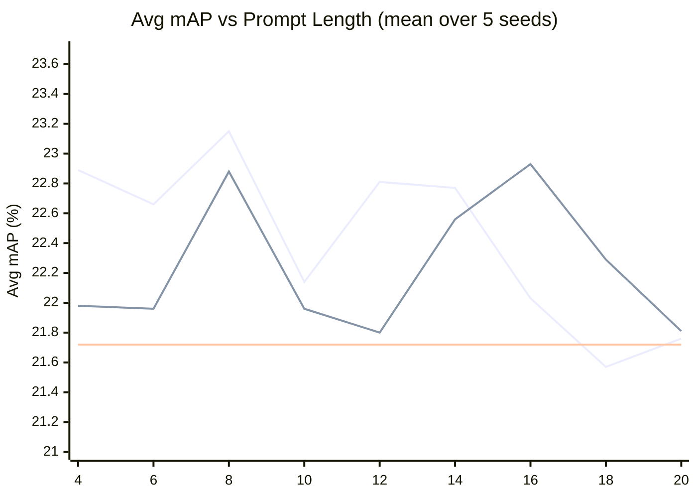
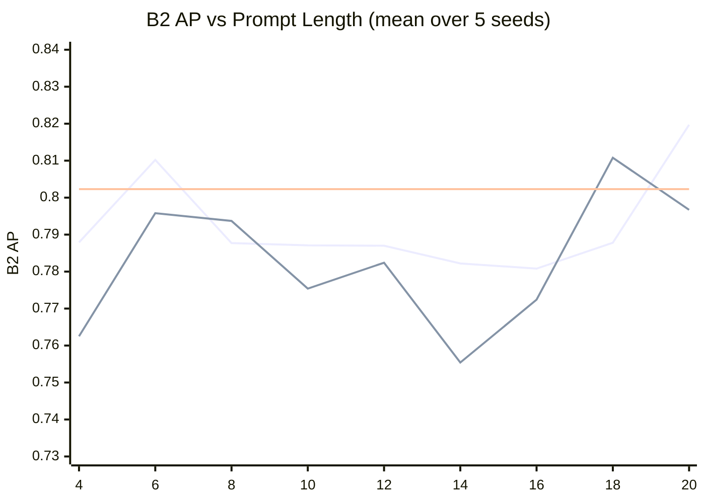

# Prompt Ablation Results (XD-Violence)

Source: `experiment/results/metrics.csv` (from line 80). Multi-seed summary over seeds 234–238 (mean ± std, 95% CI in appendix).

## Main Results

Two factors are compared: **prompt placement** (middle vs end) and **prompt length** (4–20). The figures below plot performance vs length; the horizontal baseline is **no prompt** (21.72 ± 0.71 Avg mAP, 0.8023 ± 0.0211 B2 AP).

### Figure 1 — Avg mAP vs Prompt Length

**Takeaway:** Middle placement peaks at length **8** (Avg mAP **23.15 ± 0.76**), above the no-prompt baseline (**21.72 ± 0.71**). End placement is competitive at length **16** but less stable at extreme lengths.

### Figure 2 — B2 AP vs Prompt Length

**Takeaway:** B2 AP does not monotonically increase with length. **Middle-20** and **End-18** achieve the highest branch-2 AP; short-to-medium lengths (4–8) remain near or above the no-prompt baseline (**0.8023 ± 0.0211**).

---

## Appendix A — Wide Tables (mean ± std)

Rows = prompt length; columns = placement. **Δ** = Middle − End (positive favors middle). Bold = best within column.

### A.1 Avg mAP

| Length | Middle | End | Δ (M−E) |
|--------|--------|-----|---------|
| 4 | 22.89 ± 0.89 | 21.98 ± 0.78 | +0.91 |
| 6 | 22.66 ± 0.73 | 21.96 ± 0.54 | +0.70 |
| 8 | **23.15 ± 0.76** | 22.88 ± 0.80 | +0.27 |
| 10 | 22.14 ± 0.70 | 21.96 ± 1.26 | +0.18 |
| 12 | 22.81 ± 1.38 | 21.80 ± 1.48 | +1.02 |
| 14 | 22.77 ± 0.95 | 22.56 ± 0.49 | +0.21 |
| 16 | 22.03 ± 0.51 | **22.93 ± 0.94** | −0.90 |
| 18 | 21.57 ± 0.70 | 22.29 ± 0.54 | −0.72 |
| 20 | 21.76 ± 1.17 | 21.81 ± 1.07 | −0.06 |
| *no prompt* | *21.72 ± 0.71* | — | — |

### A.2 B2 AP

| Length | Middle | End | Δ (M−E) |
|--------|--------|-----|---------|
| 4 | 0.7879 ± 0.0409 | 0.7625 ± 0.0469 | +0.0254 |
| 6 | 0.8102 ± 0.0296 | 0.7958 ± 0.0341 | +0.0144 |
| 8 | 0.7877 ± 0.0456 | 0.7937 ± 0.0509 | −0.0060 |
| 10 | 0.7871 ± 0.0392 | 0.7754 ± 0.0572 | +0.0117 |
| 12 | 0.7870 ± 0.0526 | 0.7824 ± 0.0553 | +0.0045 |
| 14 | 0.7822 ± 0.0643 | 0.7554 ± 0.0644 | +0.0268 |
| 16 | 0.7808 ± 0.0694 | 0.7724 ± 0.0711 | +0.0084 |
| 18 | 0.7878 ± 0.0566 | **0.8108 ± 0.0232** | −0.0231 |
| 20 | **0.8197 ± 0.0207** | 0.7967 ± 0.0247 | +0.0230 |
| *no prompt* | *0.8023 ± 0.0211* | — | — |

## Appendix B — 95% Confidence Intervals

### B.1 Avg mAP CI

| Length | Middle CI | End CI |
|--------|-----------|--------|
| 4 | [21.78, 23.99] | [21.01, 22.94] |
| 6 | [21.76, 23.57] | [21.29, 22.64] |
| 8 | [22.21, 24.09] | [21.89, 23.88] |
| 10 | [21.27, 23.01] | [20.39, 23.52] |
| 12 | [21.10, 24.53] | [19.96, 23.63] |
| 14 | [21.58, 23.95] | [21.95, 23.17] |
| 16 | [21.40, 22.66] | [21.76, 24.11] |
| 18 | [20.71, 22.44] | [21.63, 22.96] |
| 20 | [20.31, 23.20] | [20.48, 23.14] |
| *no prompt* | [20.84, 22.61] | — |

### B.2 B2 AP CI

| Length | Middle CI | End CI |
|--------|-----------|--------|
| 4 | [0.74, 0.84] | [0.70, 0.82] |
| 6 | [0.77, 0.85] | [0.75, 0.84] |
| 8 | [0.73, 0.84] | [0.73, 0.86] |
| 10 | [0.74, 0.84] | [0.70, 0.85] |
| 12 | [0.72, 0.85] | [0.71, 0.85] |
| 14 | [0.70, 0.86] | [0.68, 0.84] |
| 16 | [0.69, 0.87] | [0.68, 0.86] |
| 18 | [0.72, 0.86] | [0.78, 0.84] |
| 20 | [0.79, 0.85] | [0.77, 0.83] |
| *no prompt* | [0.78, 0.83] | — |

## Appendix C — Per-Seed Results

Full per-seed runs are omitted here for brevity; see `metrics.csv` (rows ≥ 80, `ablation_type=prompt_train`).
